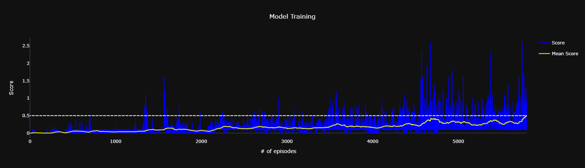

# Project 3: Collaboration and Competition

## Description of the implementation

### Algorithm

In order to solve this challenge, I have explored and implemented the Deep Deterministic Policy Gradient algorithm (DDPG).

### Development

For this project I have used the code from the previous project, which implemented the DDPG algorithm. I have then modified the code to implement Multi-Agent DDPG (MADDPG).

I also explored a variety of network architectures and hyperparameters. I started with the same architecture I used for the DDPG implementation, but I realized that it was not working well for this problem. I then tried a few other architectures, eventually settling on the following architecture and hyperparameters:

```
================================================================================
Actor Architecture:
Network(
  (network): Sequential(
    (fc1): Linear(in_features=24, out_features=256, bias=True)
    (relu1): ReLU()
    (fc2): Linear(in_features=256, out_features=256, bias=True)
    (relu2): ReLU()
    (fc3): Linear(in_features=256, out_features=2, bias=True)
    (out_activation): Tanh()
  )
)
================================================================================
Critic Architecture:
Network(
  (network): Sequential(
    (fc1): Linear(in_features=26, out_features=256, bias=True)
    (relu1): ReLU()
    (fc2): Linear(in_features=256, out_features=256, bias=True)
    (relu2): ReLU()
    (fc3): Linear(in_features=256, out_features=1, bias=True)
    (out_activation): Sigmoid()
  )
)
================================================================================
Hyperparameters:
buffer_size:     1000000
batch_size:          256
gamma:            0.9900
tau:              0.1000
actor_lr:         0.0008
actor_lr_decay:  0.99995
critic_lr:        0.0005
critic_lr_decay: 0.99995
update_every:          4
================================================================================
```

This model was able to solve the environment in about 5702 episodes, as you can see in the training progress chart below:



> The dashed line represents the target score of 0.5

### Future Work

I would like to explore the following ideas in the future:
1. Although I have spent a great deal of time tailoring the hyperparameters, there may be other sets of values that conduce the Agent to solve the environment even faster. Thus, more tests might be performed to verify that.
2. Trying some other approaches of collaborative and competitive learning.
3. Implementing the Prioritized Experience Replay.
4. Trying some of the other Actor-Critic algorithms, such as A3C, A2C, and PPO.
